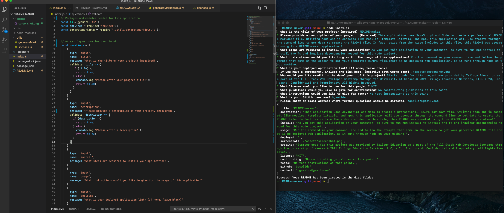

  # README-maker
  
  
  ## Description
  This application uses JavaScript and Node to create a professional README markdown file. Utlizing node and js concepts like modules, template literals, and npm, this application will use prompts through the command line to get data to create the README file. In fact, aside from the video included in this file, this README was created using this README-maker application!

  ## Table of Contents
  * [Installation](#installation)
  * [Usage](#usage)
  * [Credits](#credits)
  * [License](#license)
  * [Contributing](#contributing)
  * [Tests](#tests)
  * [Questions](#questions)
  
  ## Installation
  As you get this application on your computer, be sure to run npm install to install the fs and inquirer dependencies needed for this node project.

  ## Usage
  Run the command in your command line and follow the prompts that come on the screen to get your generated README file.There is no deployed web application, as it runs through node on your machine.

  ### Deployed link and screenshot (if applicable)
  
  

  

  ## Credits
  Starter code for this project was provided by Trilogy Education as a part of the Full Stack Web Developer Bootcamp through the University of Kansas.© 2021 Trilogy Education Services, LLC, a 2U, Inc. brand. Confidential and Proprietary. All Rights Reserved.

  ## License 
  
### MIT LICENSE

Permission is hereby granted, free of charge, to any person obtaining a copy
of this software and associated documentation files (the "Software"), to deal
in the Software without restriction, including without limitation the rights
to use, copy, modify, merge, publish, distribute, sublicense, and/or sell
copies of the Software, and to permit persons to whom the Software is
furnished to do so, subject to the following conditions:

The above copyright notice and this permission notice shall be included in all
copies or substantial portions of the Software.

THE SOFTWARE IS PROVIDED "AS IS", WITHOUT WARRANTY OF ANY KIND, EXPRESS OR
IMPLIED, INCLUDING BUT NOT LIMITED TO THE WARRANTIES OF MERCHANTABILITY,
FITNESS FOR A PARTICULAR PURPOSE AND NONINFRINGEMENT. IN NO EVENT SHALL THE
AUTHORS OR COPYRIGHT HOLDERS BE LIABLE FOR ANY CLAIM, DAMAGES OR OTHER
LIABILITY, WHETHER IN AN ACTION OF CONTRACT, TORT OR OTHERWISE, ARISING FROM,
OUT OF OR IN CONNECTION WITH THE SOFTWARE OR THE USE OR OTHER DEALINGS IN THE
SOFTWARE.

  ## Contributing
  No contributing guidelines at this point.

  ## Tests
  No test instructions at this point.

  ## Questions
  You can find my GitHub profile at https://github.com/bgswilde
  For any further questions, reach out to me via email at bgswilde@gmail.com.
